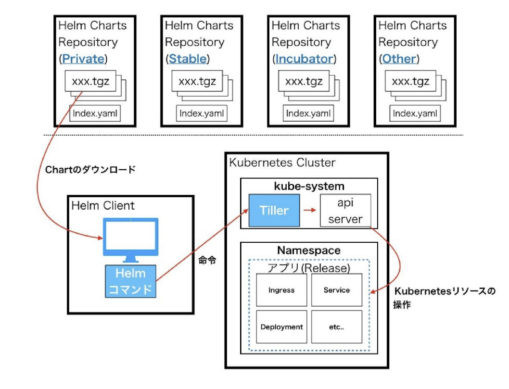
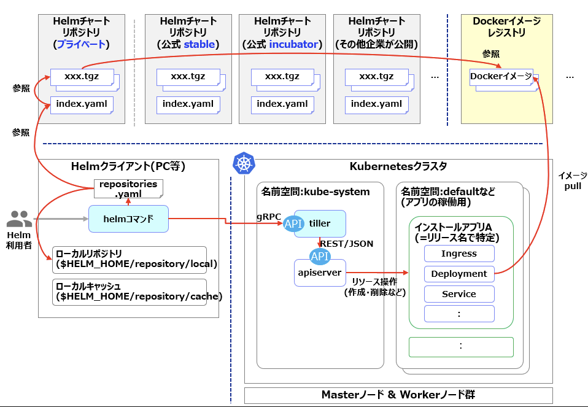

## docker compose

コンテナにすると簡単に立ち上げが可能。  
さらに docker compose を使えば、簡単に複数コンテナを立ち上げることができる。

実践

```

```

しかしそんな docker compose もエンタープライズでの利用においては不十分。

以下デメリット

- コンテナの管理を自分で行う必要がある。
- 複数のコンテナが一つのホストで立ち上がるため、システムリソースが競合することがある（？）
- 複数のコンテナが一つのホストで立ち上がるため、ポートかぶりが起こらないよう設定する必要がある

そこでコンテナオーケストレーションツールである kubernetes が必要である

## Kubernetes

エンタープライズでの利用が増えている kubernetes。コンテナオーケストレーションのデファクトスタンダードと言える。

kuberntes のメリット

- self healing (自己回復)
- Immutable infrastructure (不変なサーバー基盤)
- autoscaling (自動的な規模の調整)

実践

```

```

一方で次のようなデメリットもある

- 教育コストの高さ: kubernetes は複数のリソースを組み合わせて扱うため、これらを学習する必要がある。
- Wall of YAML: 一つのアプリケーションを定義するために大量の YAML を書く必要がある。
- 変化の速さ: 変化が非常に早いため、組織で利用する場合、その変化の速さに適応する文化の醸成が必要。

そこで helm の登場である。

## Helm

helm の利点

- 複雑な YAML を意識せず、主要なアプリケーションをコマンド一つで kubernetes 上に展開可能
- パラメータを変えることで、オンプレミス・パブリッククラウドなど環境を合わせたり、永続化を利用の有無を選択したりできる。
- chart というフォーマットから、アプリケーションの YAML ファイルを取得することが可能
- chart を自作することで、自作アプリのデプロイもコマンド一つで可能

特に一番上が強力なメリット。

実践

```

```

### helm を利用するに当たりよく出てくる単語

| 要素        | 概要                                                                                         | 補足                                                                                                                                                                    |
| ----------- | -------------------------------------------------------------------------------------------- | ----------------------------------------------------------------------------------------------------------------------------------------------------------------------- |
| chart       | helm で利用するパッケージのテンプレ                                                          | 実体は.tgz 形式の圧縮ファイル。様々なファイル群で構成され、Kubernetes のリソースを生成するためのテンプレートファイルやデフォルト値の設定ファイルなどが含まれる          |
| helm client | helm を操作するためのコマンドラインツール                                                    | ローカル OS 環境の$HELM_HOME でポイントする場所に、設定ファイル群や、「ローカルリポジトリ」を作り出し、その上で tiller と通信して Kubernetes クラスタとのやりとりを行う |
| tiller      | kube クラスター上で稼働する helm のサーバー                                                  | helm コマンドからの要求に基づき、apiserver を介して Kubernetes クラスタ内のリソース作成・削除・情報取得などの操作を行う                                                 |
| release     | chart を使って実際にデプロイ(インストール)されたクラスタ上のオブジェクトをまとめて表したもの | リリースは、暗黙にせよ明示的にせよ、「リリース名」が必ず与えられ、識別される                                                                                            |
| リポジトリ  | chart を保管し、 helm クライアントに提供するリポジトリサーバー                               | 仕様として定められた index.yaml および chart ファイル(.tgz)群をサービスすれば、それは chart リポジトリとなりえる                                                        |

|
|:-:|

|
|:-:|

※ helm v3 では tiller サーバーが廃止されている。今回の練習では helm v2 で行うものとする

公開されている chart には、安定した Stable 版と、Stable には昇格はしていないが、chart として使用可能な Incubator 版がある。デフォルトでは helm に登録されているリポジトリは Stable 版だけで、Incubator 版を使用したい場合は手動で追加する必要がある。（03 にて詳しく説明する）

### Helm チャートの構造

```
<チャート名ディレクトリ>/
  Chart.yaml          # チャートの概要が記述されたYAMLファイル(ファイル名は予約)
  LICENSE             # オプション:このチャートのライセンス情報
  README.md           # オプション: チャートの説明
  requirements.yaml   # オプション: このチャートが利用する(依存する)他のチャートの一覧。(ファイル名は予約)
  values.yaml         # このチャートのデフォルト設定値が定義されたYAMLファイル。ファイル名は予約)
  charts/             # このチャートが依存するチャートをコピー配置するディレクトリ(ディレクトリ名は予約)
  templates/          # チャートの本体ともいえる、KubernetesオブジェクトのリソースYAMLのテンプレート群を配置するディレクトリ(ディレクトリ名は予約)
  templates/NOTES.txt # オプション:利用方法を生成するテキストファイル
  tests/              # オプション:helm testで実行されるテスト用YAMLを配置するディレクトリ(ディレクトリ名は予約)
```

上記の Chart.yaml、requirementes.yaml, values.yaml そして templates ディレクトリはまずはそのファイル名と役割は理解しておくことが何よりも必要

またその中でも自作 Chart の場合は chart.yaml, values.yaml, templates ディレクトリが重要

### chart.yaml

- chart の説明やソースリポジトリなどの情報が記載。

### values.yaml

- template 配下の kubernetes マニフェストを利用するための変数とその値を定義している。

### templates ディレクトリ

- kubernetes マニフェストファイル群が配置。

## 参考

- [Helm の概要と Chart(チャート)の作り方](https://qiita.com/thinksphere/items/5f3e918015cf4e63a0bc)
