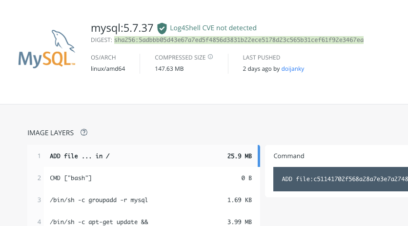
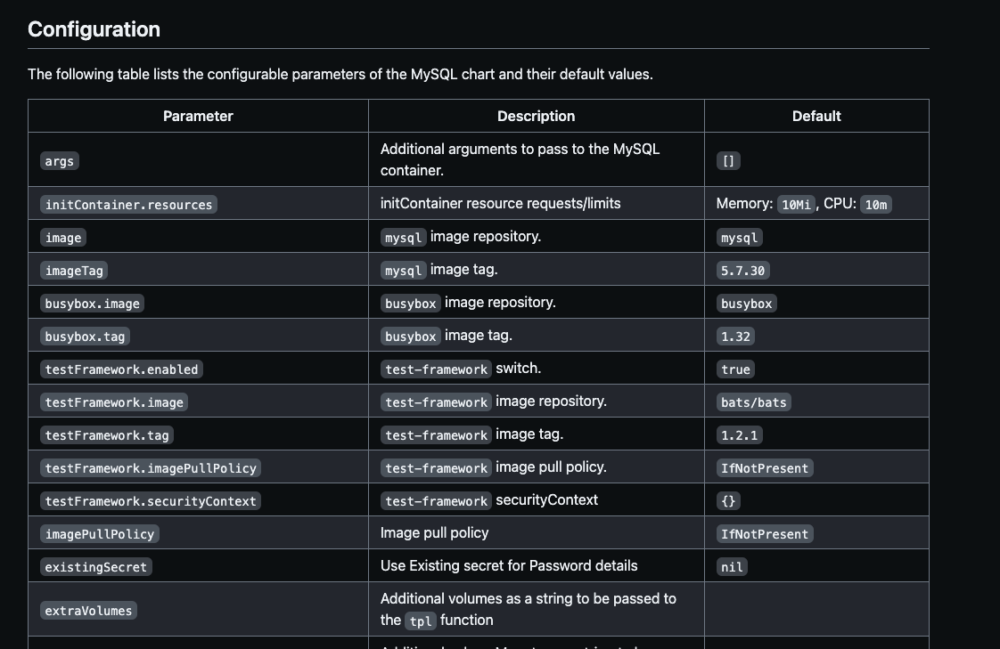

# Mysql をデプロイ

## mysql をインストール

コマンド練習の段階で `helm fetch stable/mysql` で chart はリポジトリからダウンロード済み

```sh
# 確認
$ ls | grep mysql
mysql-1.6.9.tgz
```

`helm install` コマンドで release をインストールする。
ローカルに chart がなくても勝手に取ってきてくれるらしい。

```sh
$ helm install stable/mysql
WARNING: This chart is deprecated
NAME:   tailored-whippet
LAST DEPLOYED: Sat Feb 26 16:19:31 2022
NAMESPACE: default
STATUS: DEPLOYED

RESOURCES:
==> v1/ConfigMap
NAME                         DATA  AGE
tailored-whippet-mysql-test  1     0s
(略)
```

### 注意

ここで気づいたが、pod が ImagePullBackOff となっていた。

describe して確認

```sh
$ kubectl describe po tailored-whippet-mysql-6fcc64fbb9-746p6

(省略)

Events:
  Type     Reason            Age                From               Message
  ----     ------            ----               ----               -------
  Warning  FailedScheduling  33s                default-scheduler  0/1 nodes are available: 1 pod has unbound immediate PersistentVolumeClaims.
  Normal   Scheduled         32s                default-scheduler  Successfully assigned default/existing-zebu-mysql-6bc4fbb69c-zss7z to docker-desktop
  Normal   Pulled            31s                kubelet            Container image "busybox:1.32" already present on machine
  Normal   Created           31s                kubelet            Created container remove-lost-found
  Normal   Started           31s                kubelet            Started container remove-lost-found
  Normal   BackOff           27s                kubelet            Back-off pulling image "mysql:5.7.30"
  Warning  Failed            27s                kubelet            Error: ImagePullBackOff
  Normal   Pulling           14s (x2 over 30s)  kubelet            Pulling image "mysql:5.7.30"
  Warning  Failed            11s (x2 over 27s)  kubelet            Failed to pull image "mysql:5.7.30": rpc error: code = Unknown desc = no matching manifest for linux/arm64/v8 in the manifest list entries
  Warning  Failed            11s (x2 over 27s)  kubelet            Error: ErrImagePull
```

どうやら image を性格にとってこれてない模様。  
いつぞやもあったが、MySQL の指定の仕方を amb64 側の Image で id 指定することで解決させた。

`sample-0.1.0.tgz` を解凍して、`deployment.yaml` と `values.yaml` を修正した。

解凍

```sh
$ tar -xzvf mysql-1.6.9.tgz
x mysql/Chart.yaml
x mysql/values.yaml
(省略)

# 確認
$ tree mysql
mysql
├── Chart.yaml
├── README.md
├── templates
│   ├── NOTES.txt
│   ├── _helpers.tpl
│   ├── configurationFiles-configmap.yaml
│   ├── deployment.yaml
│   ├── initializationFiles-configmap.yaml
│   ├── pvc.yaml
│   ├── secrets.yaml
│   ├── serviceaccount.yaml
│   ├── servicemonitor.yaml
│   ├── svc.yaml
│   └── tests
│       ├── test-configmap.yaml
│       └── test.yaml
└── values.yaml

2 directories, 15 files
```

`deployment.yaml`

```yml
containers:
    - name: {{ template "mysql.fullname" . }}
       (-) image: "{{ .Values.image }}-{{ .Values.imageTag }}"
       (+) image: "{{ .Values.image }}@{{ .Values.imageTag }}"
```

`values.yaml`

```yml
    image: "mysql"
(-) imageTag: "5.7.30"
(+) imageTag: "sha256:5adbbb05d43e67a7ed5f4856d3831b22ece5178d23c565b31cef61f92e3467ea"

```

|
|:-:|

インストールして確認

```sh
$ helm install mysql/
WARNING: This chart is deprecated
NAME:   opinionated-bee
LAST DEPLOYED: Sat Feb 26 16:59:43 2022
NAMESPACE: default
STATUS: DEPLOYED

RESOURCES:
==> v1/ConfigMap
NAME                        DATA  AGE
opinionated-bee-mysql-test  1     0s

==> v1/Deployment
NAME                   READY  UP-TO-DATE  AVAILABLE  AGE
opinionated-bee-mysql  0/1    1           0          0s

==> v1/PersistentVolumeClaim
NAME                   STATUS  VOLUME                                    CAPACITY  ACCESS MODES  STORAGECLASS  AGE
opinionated-bee-mysql  Bound   pvc-f30be954-69e4-48b8-afaf-144a4651f995  8Gi       RWO           hostpath      0s

==> v1/Pod(related)
NAME                                    READY  STATUS    RESTARTS  AGE
opinionated-bee-mysql-7897bc9576-55px5  0/1    Init:0/1  0         0s

==> v1/Secret
NAME                   TYPE    DATA  AGE
opinionated-bee-mysql  Opaque  2     0s

==> v1/Service
NAME                   TYPE       CLUSTER-IP    EXTERNAL-IP  PORT(S)   AGE
opinionated-bee-mysql  ClusterIP  10.99.25.222  <none>       3306/TCP  0s


NOTES:
MySQL can be accessed via port 3306 on the following DNS name from within your cluster:
opinionated-bee-mysql.default.svc.cluster.local

To get your root password run:

    MYSQL_ROOT_PASSWORD=$(kubectl get secret --namespace default opinionated-bee-mysql -o jsonpath="{.data.mysql-root-password}" | base64 --decode; echo)

To connect to your database:

1. Run an Ubuntu pod that you can use as a client:

    kubectl run -i --tty ubuntu --image=ubuntu:16.04 --restart=Never -- bash -il

2. Install the mysql client:

    $ apt-get update && apt-get install mysql-client -y

3. Connect using the mysql cli, then provide your password:
    $ mysql -h opinionated-bee-mysql -p

To connect to your database directly from outside the K8s cluster:
    MYSQL_HOST=127.0.0.1
    MYSQL_PORT=3306

    # Execute the following command to route the connection:
    kubectl port-forward svc/opinionated-bee-mysql 3306

    mysql -h ${MYSQL_HOST} -P${MYSQL_PORT} -u root -p${MYSQL_ROOT_PASSWORD}


# 確認
$ kubectl get po
NAME                                     READY   STATUS      RESTARTS   AGE
opinionated-bee-mysql-7897bc9576-55px5   1/1     Running     0          14m
```

### 参考

[M1 の kubernetes で詰まったところ調査](https://zenn.dev/ohkisuguru/scraps/5b9d76333ff13d)

## mysql にアクセス

NOTES に書かれている手順に従って、kubernetes クラスタ内から mysql にアクセスする。

1. パスワード取得

```sh
$ MYSQL_ROOT_PASSWORD=$(kubectl get secret --namespace default opinionated-bee-mysql -o jsonpath="{.data.mysql-root-password}" | base64 --decode; echo)

# 確認
$ echo $MYSQL_ROOT_PASSWORD
7c5lR8zX1H
```

2. mysql にアクセスするために、Ubuntu イメージに mysql クライアントをインストールした pod を作成

```
# mysql にアクセスするための clientpod を作成
$ kubectl run -i --tty ubuntu --image=ubuntu:16.04 --restart=Never -- bash -il

# mysql クライアントをインストール
If you don't see a command prompt, try pressing enter.
root@ubuntu:/# apt-get update && apt-get install mysql-client -y

# mysql DB に接続
root@ubuntu:/# mysql -h opinionated-bee-mysql -p
Enter password:
Welcome to the MySQL monitor.  Commands end with ; or \g.
Your MySQL connection id is 289
Server version: 5.7.37 MySQL Community Server (GPL)

Copyright (c) 2000, 2021, Oracle and/or its affiliates.

Oracle is a registered trademark of Oracle Corporation and/or its
affiliates. Other names may be trademarks of their respective
owners.

Type 'help;' or '\h' for help. Type '\c' to clear the current input statement.

mysql>
```

mysql にログインできた。

3. 削除する

```sh
$ helm delete opinionated-bee --purge
release "opinionated-bee" deleted
```

## `values.yaml` の値を変更してデプロイ

mysql がうまくデプロイできない問題で対応したように行えば良い。
手順として

```sh
# 1. リポジトリから chart をダウンロード
$ helm fetch stable/mysql

# 2. 確認
$ ls | grep mysql
mysql-1.6.9.tgz

# 3. 解凍
$ tar -xzvf mysql-1.6.9.tgz
```

chart のデフォルト値は `values.yaml` に記載されている。

試しに、imageTag を変更してみるとする。
`values.yaml` の値を変更するには 2 つの方法がある

- --set フラグを使ってコマンドラインで変更する。
- -f または --values フラグを使ってファイル指定で変更する。

### --set フラグを使ってコマンドラインで変更する。

--set key=value 形式でパラメーターをコマンドライン上で渡すことで、release の設定や挙動を変えることができる。

M1 チップのためうまくデプロイはできないが試してみる。
`imageTag: "5.7.30"` を `"5.7.25"` に変更してみる。

```sh
# imageTag を指定したタグでインストール
$ helm install --set imageTag=5.7.25 stable/mysql

# mysql のimageTag を確認
$ kubectl get po winning-pug-mysql-584f8894f5-nhh5z -o json | jq '.spec | .containers[] | .image'
"mysql:5.7.25"
```

このようにコマンドラインで値を指定するだけでコンテナの挙動や設定を変えることができた。  
たいていの chart では image の種類だけでなく、service の type や persistentVolume の有無、ingress の有無などが変更できる。

--set で指定するパラメータの種類や詳細を調べたいときは、`helm inspect` や Github の各 chart の README で確認できる。

https://github.com/helm/charts/tree/master/stable/mysql

|
|:-:|

`helm inspect` を使うと

```
$ helm inspect stable/mysql
## Configuration

The following table lists the configurable parameters of the MySQL chart and their default values.

| Parameter                  | Description                                             | Default                      |
| -------------------------- | ------------------------------------------------------- | ---------------------------- |
| `args`                     | Additional arguments to pass to the MySQL container.    | `[]`                         |
| `initContainer.resources`  | initContainer resource requests/limits                  | Memory: `10Mi`, CPU: `10m`   |
| `image`                    | `mysql` image repository.                               | `mysql`                      |
| `imageTag`                 | `mysql` image tag.                                      | `5.7.30`                     |
| `busybox.image`            | `busybox` image repository.                             | `busybox`                    |
(省略)
```

### -f または --values フラグを使ってファイル指定で変更する。

-f または --values フラグを使ってファイル指定で、release の設定や挙動を変えることができる。

`imageTag: "5.7.30"` と記載した `values.yaml` を準備する。

```sh
$ echo 'imageTag: "5.7.25"' > values.yaml
```

インストール

```sh
# helm install --value values.yaml stable/mysql でも可
$ helm install -f values.yaml stable/mysql
WARNING: This chart is deprecated
NAME:   geared-ostrich
(省略)

# mysql のimageTag を確認
$ kubectl get po geared-ostrich-mysql-f8b85f7dc-r8776 -o json | jq '.spec | .containers[] | .image'
"mysql:5.7.25"
```

chart では非常に多くの値を変更できる。  
このようにパラメーターを変更して細かくチューニングする場合、コマンドラインで実行するのは限界がある。  
そこで、 values.yaml に記載することで、宣言的な IaC を実現できる。

また、ファイルを複数指定することができる。

例として、mysql の imageTag を「5.7.30」から「5.7.14」に  
initContainer で利用している busybox の tag を「1.32」から「1.30」にしてみる

準備

```sh
# mysql の方の準備
$ echo 'imageTag: "5.7.25"' > values.yaml

# ヒアドキュメントで busybox の方を準備
$ cat <<EOF > values2.yaml
busybox:
  tag: "1.30"
EOF
```

インストール

```sh
$ helm install -f values.yaml -f values2.yaml stable/mysql
WARNING: This chart is deprecated
NAME:   triangular-ragdoll
(省略)

# 確認
$ kubectl get po triangular-ragdoll-mysql-7587b8dc9f-6kpjj -o json | jq '.spec | .containers[] | .image'
"mysql:5.7.25"

$ kubectl get po triangular-ragdoll-mysql-7587b8dc9f-6kpjj -o json | jq '.spec | .initContainers[] | .image'
"busybox:1.30"
```

### 試す

普通にこのようなファイルを用意しててもうまくいくんじゃない？と思ったのでやってみる。

values3.yaml

```yml
imageTag: "5.7.25"
busybox:
  tag: "1.30"
```

```sh
$ helm install -f values3.yaml stable/mysql
WARNING: This chart is deprecated
NAME:   gauche-otter
(省略)
```

確認コマンドで、それぞれの imageTag と tag を取得するとちゃんと反映されていた。

### 試す 2

ローカルにある chart の上書きはできるのだろうか。と思いやってみる。  
imageTag は色々変更を加えてしまっているので、変更部分は busybox の tag のみにしてみる。  
tag を「1.32」から「1.30」に変更。

```sh
# 確認
$ cat values2.yaml
busybox:
  tag: "1.30"

$ helm install -f values2.yaml mysql/
WARNING: This chart is deprecated
NAME:   braided-toad
(省略)

# 確認
$ kubectl get po braided-toad-mysql-6f4b79c654-wx744 -o json | jq '.spec | .initContainers[] | .image'
"busybox:1.30"
```

普通にできた。

## おまけ

複数のファイルを指定できるため、以下のような構成をとっておいて、パイプライン実行時に環境に適した値でインストールやアップデートができるというメリットが有る。

```sh
mychart
├── env
│   ├── dev.yaml
│   ├── production.yaml
│   └── staging.yaml
├── templates
└── values.yaml
```

```sh
# dev 環境に、dev 環境用の設定値でインストールする。
$ helm install -f values.yaml -f dev.yaml /mychart

# staging 環境に、staging 環境用の設定値でインストールする。
$ helm install -f values.yaml -f staging.yaml /mychart

# production 環境に、production 環境用の設定値でインストールする。
$ helm install -f values.yaml -f production.yaml /mychart
```

## 参考

[M1 の kubernetes で詰まったところ調査](https://zenn.dev/ohkisuguru/scraps/5b9d76333ff13d)
